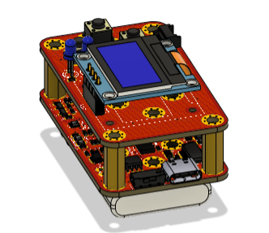
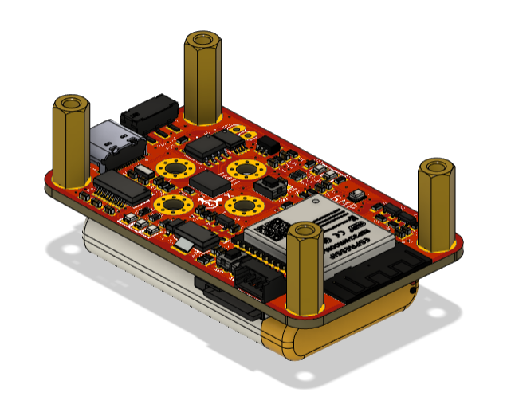

# IMU_BNO055_BMP280_DATA_LOGGING

## Spesification
- ESP32 WROOM
- USB TYPE C
- FT231 as USB Proggrammer
- BNO055
- BMP280
- OLED DISPLAY
- I2C expander for Button
- Modul charger tp4056 for Charger Lipo Batt
- Switch On OFF
- SD Card as save Data Loging

## Preview Hardware

  
  
  
  
  
  
  
  

